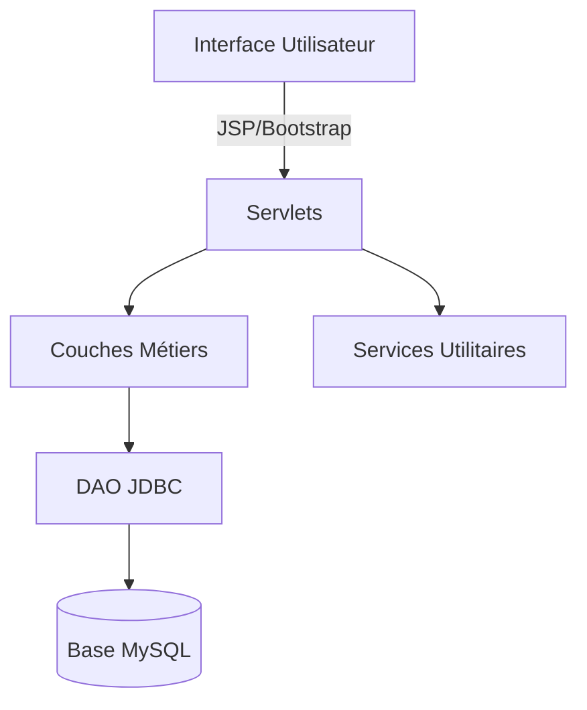

[](https://opensource.org/licenses/MIT)


# 🎓 StudentManager - Gestion Scolaire Intelligente

**Application web complète de gestion académique**  
*Développée en Java EE avec architecture MVC et interface Bootstrap moderne*


## ✨ Fonctionnalités Avancées

### 🧑‍🎓 Gestion des Étudiants
- **Inscription complète** avec validation des données
- **Fiche étudiante détaillée** (coordonnées, parcours académique)
- **Recherche intelligente** (nom, filière, promotion)


### 🔐 Sécurité
- **Authentification** des utilisateurs
- **Journalisation** des activités (log4j)
- **Protection CSRF** intégrée

## 🛠 Architecture Technique



**Stack complète :**
- **Frontend** : JSP 2.3 + Bootstrap 5 + JavaScript
- **Backend** : Servlets Java EE 8
- **Data** : JDBC avec connection pooling
- **Sécurité** : Filtrés d'authentification
- **Build** : Maven

## 🚀 Guide d'Installation

### Prérequis
- Java 11+
- Apache Tomcat 9+
- MySQL 8.0+
- IDE (Eclipse/IntelliJ)

### Étapes
1. Cloner le dépôt :
   ```bash
   git clone https://github.com/ton-compte/StudentManager.git
   cd StudentManager
   ```


## 📄 Licence

Licence MIT - Voir [LICENSE](LICENSE) pour plus de détails.

